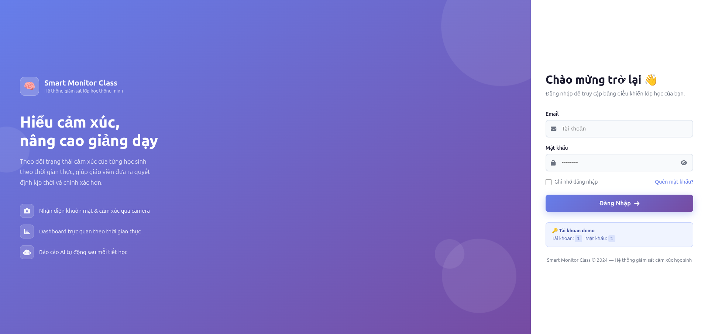
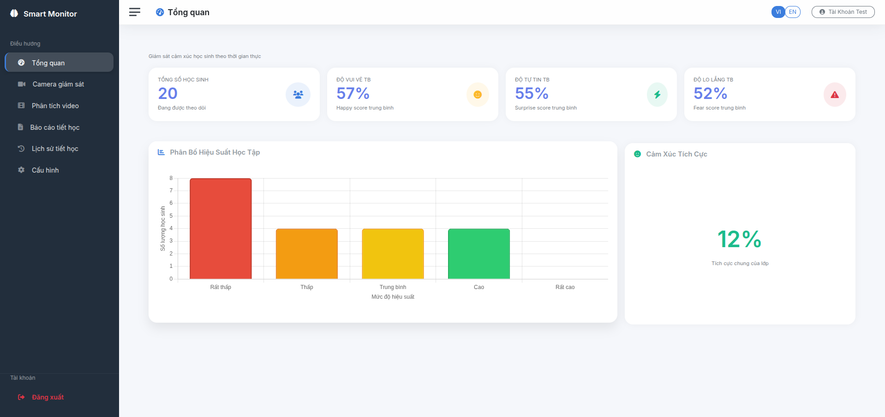

# Smart Monitor for Classes 🧠
> **Hệ thống giám sát lớp học thông minh - Phân tích cảm xúc và hành vi bằng AI**

## 🌟 Giới Thiệu
**Smart Monitor for Classes** là một hệ thống hỗ trợ giáo dục hiện đại, sử dụng công nghệ nhận diện khuôn mặt và phân tích cảm xúc (Emotion Recognition) để cung cấp cái nhìn sâu sắc về trạng thái của học sinh trong lớp học. Hệ thống giúp giáo viên điều chỉnh phương pháp giảng dạy kịp thời nhằm nâng cao hiệu quả giáo dục.

---

## 📸 Giao Diện Ứng Dụng

### 🔐 Hệ Thống Đăng Nhập
Giao diện đăng nhập hiện đại, hỗ trợ ghi nhớ tài khoản và phân quyền người dùng.

### 📊 Bảng Điều Khiển (Dashboard)
Trình diễn dữ liệu trực quan với các biểu đồ thống kê cảm xúc, mức độ tập trung và hiệu suất học tập của lớp học theo thời gian thực.

---

## 🚀 Tính Năng Nổi Bật
- **Nhận diện khuôn mặt (Face Recognition)**: Sử dụng MTCNN và InceptionResnetV1 để nhận diện chính xác từng học sinh.
- **Phân tích cảm xúc (Emotion Detection)**: Phân loại 7 trạng thái cảm xúc cơ bản thông qua mô hình ResNet50 tối ưu.
- **Báo cáo AI (AI-Powered Insights)**: Tự động tổng hợp dữ liệu và tạo báo cáo sư phạm bằng Google Gemini/Groq.
- **Giám sát linh hoạt**: Hỗ trợ cả Camera trực tiếp tại lớp hoặc phân tích qua file Video có sẵn.
- **Quản lý lịch sử**: Hệ thống lưu trữ thông minh giúp tra cứu lại dữ liệu của bất kỳ tiết học nào.

## 🛠️ Cài Đặt & Triển Khai
Để chạy ứng dụng trên môi trường Localhost, bạn chỉ cần thực hiện theo các bước trong hướng dẫn chạy nhanh:
👉 **[Hướng dẫn cài đặt (RUN_GUIDE.txt)](RUN_GUIDE.txt)**

## 📖 Hướng Dẫn Sử Dụng
Tài liệu hướng dẫn chi tiết các tính năng dành cho giáo viên và người quản lý:
👉 **[Hướng dẫn sử dụng (USER_GUIDE.md)](USER_GUIDE.md)**

---
**Phát triển bởi [Zinex-23](https://github.com/Zinex-23)**
*Dự án nghiên cứu khoa học về ứng dụng AI trong giáo dục.*
